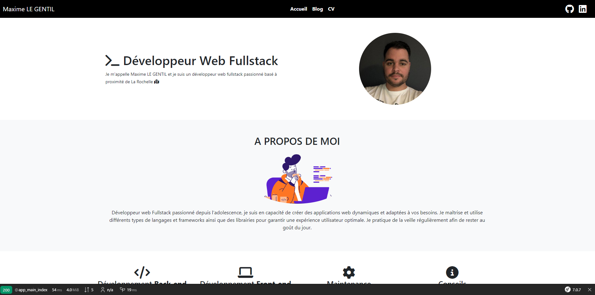

# Portfolio Maxime LE GENTIL

Ce repository a pour but de contenir et de montrer le code de mon portfolio aux potentiels recruteurs.

# Technos utilisées

- HTML
- CSS
- JS
- Bootstrap
- Symfony
- ORM Doctrine
- Composer

# Installation

- Cloner le repo
- Installer les dépendances à l'aide de composer (composer install)
- Configurer les variables d'environnement (.env)
- Créer la base de données (php bin/console do:da:cr)
- Executer les fixtures (php bin/console do:fi:lo)
- Lancer un serveur web ou naviguer dans votre localhost pour accéder à l'app depuis le dossier public
- C'est bon !

# Aperçu de l'application

